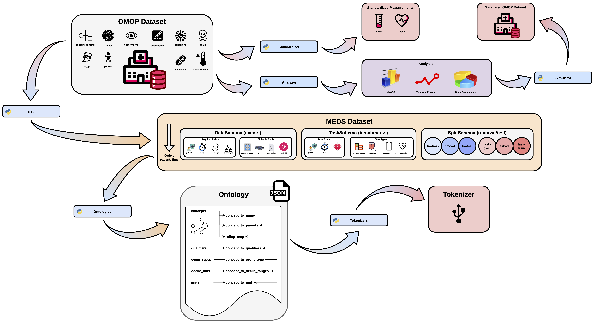

# meds-biobank

> Unofficial, lightweight Python re-implementation of parts of the **MEDS** software ecosystem, built to operate on in-memory tables loaded via PySpark rather than directly on disk. Designed for small-to-medium biobanks queried through cloud services in interactive Python notebooks.

**Primary target:** Penn Medicine Biobank

---

## Table of Contents

- [Diagram](#diagram)
- [Features](#features)
  - [Standardizers](#standardizers)
  - [ETL_Pipelines](#etl_pipelines)
  - [Ontologies](#ontologies)
  - [Tokenizers](#tokenizers)

---

## Diagram

---

## Features

### Standardizers

Docs: [docs](docs/standardizers.md)

---

### ETL_Pipelines 

Docs: [docs](docs/etl_pipelines.md)

---

### Ontologies

Docs: [docs](docs/ontologies.md)

---

### Tokenizers

Docs: [docs](docs/tokenizers.md)

---
